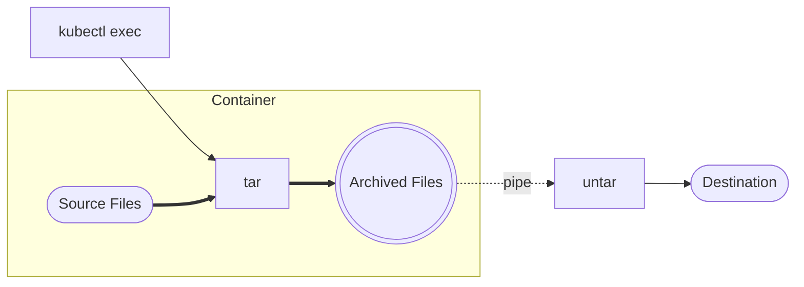

# Tarfetch

_**Made with the file-freshening properties of tar!**_

This extension leverages `kubectl exec` and `tar` to archive files in a Kubernetes container and extract them to a destination on the local filesystem.



Tarfetch's only requirement is that both the local machine and container have `tar` installed. This is typically a given ([yes, even on Windows](https://docs.microsoft.com/en-us/virtualization/community/team-blog/2017/20171219-tar-and-curl-come-to-windows)).

## Example

Create a local resource called "tarfetch-app" which connects to the first pod of "deploy/frontend" (and the default container) and syncs the contents of "/app/" to local directory "./frontend" while ignoring all directories named "node_modules":

```starlark
# Import extension
load('ext://tarfetch', 'tarfetch')

# Setup tarfetch to attach the button to a Tilt resource
tarfetch(
   'tilt-app-resource', 
   'deployments/frontend',
   '/app/',
   './frontend',
   ignore=["node_modules"]
)
```

## Usage

A `tarfetch` resource can be created with the following parameters:

### Required parameters

* **tilt_resource (str)**: name of Tilt resource to bind button to
* **k8s_resource (str)**: a Kubernetes object identifier (e.g. `deploy/my-deploy`, `job/my-job`, or a pod ID) that Tilt can use to select a pod. As per the behavior of `kubectl exec`, we will act on the first pod of the specified object, using the first container by default
* **src_dir (str)**: directory *in the remote container* to sync from. Any `paths`, if specified, should be relative to this dir. This path *must* be a directory and must contain a trailing slash (e.g. `/app/` is acceptable; `/app` is not)

### Optional parameters

* **target_dir (str, optional)**: directory *on the local filesystem* to sync to. Defaults to `'.'`
* **namespace (str, optiona)**: namespace of the desired `k8s_object`, if not `default`.
* **container (str, optional)**: name of the container to sync from (by default, the first container)
* **ignore (List[str], optional)**: patterns to ignore when syncing, [see `tar --exclude` documentation for details on supported patterns](https://www.gnu.org/software/tar/manual/html_node/exclude.html).
* **keep_newer (bool, optional)**: prevents files overwrites when the destination file is newer. Default is true.
* **verbose (bool, optional)**: if true, shows tar extract activity.


